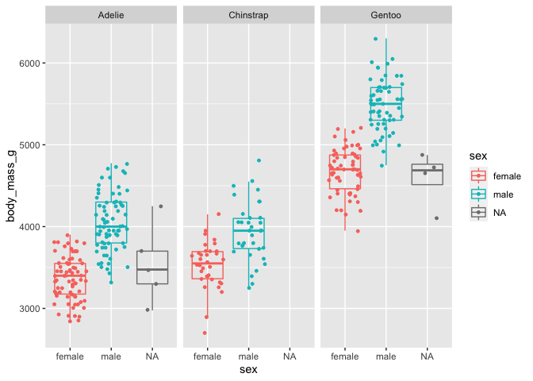

Penguins
================

## Data

The `palmerpenguins` data contains size measurements for three penguin
species observed on three islands in the Palmer Archipelago, Antarctica:
<https://allisonhorst.github.io/palmerpenguins/>


(Artwork by @allison_horst)

``` r
names(penguins)
```

    ## [1] "species"           "island"            "bill_length_mm"   
    ## [4] "bill_depth_mm"     "flipper_length_mm" "body_mass_g"      
    ## [7] "sex"               "year"

## Single trait distribution

Exploring the distribution of single morphological traits:

``` r
#par(mfrow=c(1,2))
ggplot(data = penguins) +
  geom_boxplot(mapping = aes(x = species, y = flipper_length_mm, col = species))
```

<!-- -->

``` r
ggplot(data = penguins) +
  geom_density(mapping = aes(x = flipper_length_mm, fill = species), alpha = 0.5)
```

<!-- -->

## Relationship between multiple traits

Exploring the relationship between different morphological traits:

``` r
penguins %>%
  ggplot(mapping = aes(x = body_mass_g, y = flipper_length_mm, col = species, shape = species)) +
  geom_point() +
  geom_smooth(method = "lm", aes(linetype = species))
```

    ## `geom_smooth()` using formula 'y ~ x'

<!-- -->

## Sexual dimorphism

Is there sexual dimorphism in morphological traits of penguins?

``` r
penguins %>%
  ggplot(mapping = aes(x = body_mass_g, y  = sex, col = sex))  +
  geom_boxplot(alpha = 0) +
  geom_jitter(size = 1) +
  coord_flip() +
  facet_wrap(~ species)
```

<!-- -->
